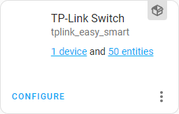
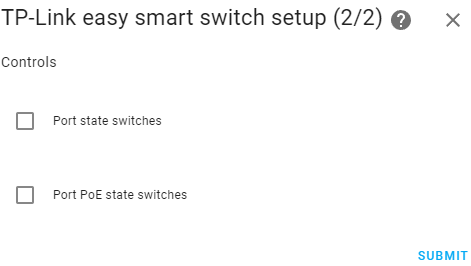

# TP-Link Easy Smart switches component for Home Assistant

Home Assistant custom component for control TP-Link Easy Smart switches over LAN.

## Key features

- obtaining information about all ports:
  - connection status
  - actual connection speed
  - configured connection speed
  - Poe status
  - Poe details (priority, power limits, actual power/current/voltage, power delivery class)
- ports management:
  - enable or disable specific ports
  - setting PoE parameters on the specified ports (enable/disable, priority, power limits)
- obtaining hardware and firmware version of the switch
- obtaining information about total PoE consumption
- setting limits on total PoE consumption
- automatic detection of available functions

## Supported models

|                                          Name                                            |  Revision | Confirmed |           Notes                             |
|------------------------------------------------------------------------------------------|-----------|-----------|---------------------------------------------|
| [TL-SG1016PE](https://www.tp-link.com/en/business-networking/poe-switch/tl-sg1016pe/)    |   V1, V3  |    Yes    | All features are available                  |
| [TL-SG105E](https://www.tp-link.com/en/business-networking/easy-smart-switch/tl-sg105e/) |     V5    |    Yes    | PoE is not supported by device              |
| [TL-SG108E](https://www.tp-link.com/en/business-networking/easy-smart-switch/tl-sg108e/) |     V6    |    Yes    | Network information & Port status supported |
| Other Easy Smart switches with web-based user interface                                  | --------- |    No     | Will most likely work                   

## Installation

### Manual

Copy `tplink_easy_smart` folder from [latest release](https://github.com/vmakeev/hass_tplink_easy_smart/releases/latest) to `custom_components` folder in your Home Assistant config folder and restart Home Assistant. The final path to folder should look like this: `<home-assistant-config-folder>/custom_components/tplink_easy_smart`.

### HACS

[Add a custom repository](https://hacs.xyz/docs/faq/custom_repositories/) `https://github.com/vmakeev/hass_tplink_easy_smart` with `Integration` category to [HACS](https://hacs.xyz/) and restart Home Assistant.

## Configuration

Configuration > [Integrations](https://my.home-assistant.io/redirect/integrations/) > Add Integration > [TP-Link Easy Smart](https://my.home-assistant.io/redirect/config_flow_start/?domain=tplink_easy_smart)

### Advanced options

You can perform advanced component configuration by clicking the `CONFIGURE` button after adding it. 

Advanced settings include:
|                                          Name                                           |  Default   |
|-----------------------------------------------------------------------------------------|------------|
| Update interval                                                                         | 30 seconds |
| Enabling or disabling [port state switches](docs/controls.md#port-state-switch)         |  Disabled  |
| Enabling or disabling [port PoE state switches](docs/controls.md#port-poe-state-switch) |  Disabled  |

## Sensors

* Network information ([read more](docs/sensors.md#network-information))
* PoE consumption ([read more](docs/sensors.md#poe-consumption))

## Binary sensors

* Port status ([read more](docs/sensors.md#port-status))
* Port PoE status ([read more](docs/sensors.md#port-poe-status))

## Switches

* Port state ([read more](docs/controls.md#port-state-switch))
* Port PoE state ([read more](docs/controls.md#port-poe-state-switch))

## Services

* Set the PoE power limit ([read more](docs/services.md#set-the-poe-power-limit))
* Set PoE settings for a specific port ([read more](docs/services.md#set-poe-settings-for-a-specific-port))
