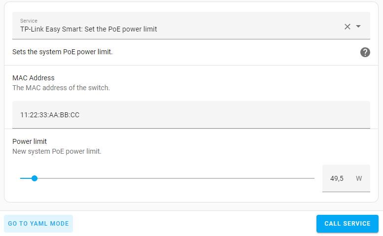
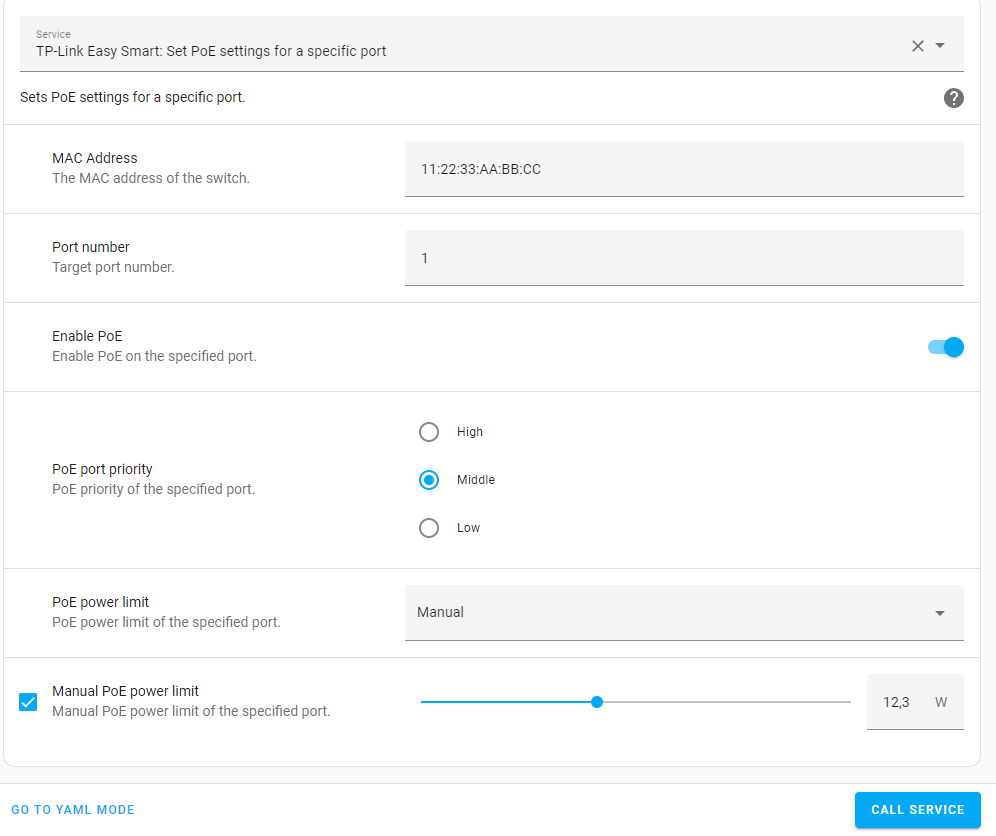

# Services

The component provides access to some services that can be used in your automations or other use cases.


## Set the PoE power limit

Service name: `tplink_easy_smart.set_general_poe_limit`

Example:
```
service: tplink_easy_smart.set_general_poe_limit
data:
  mac_address: 11:22:33:AA:BB:CC
  power_limit: 49.5
```



Sets the system PoE power limit.


## Set PoE settings for a specific port

Service name: `tplink_easy_smart.set_port_poe_settings`

Example:
```
service: tplink_easy_smart.set_port_poe_settings
data:
  mac_address: 11:22:33:AA:BB:CC
  port_number: 1
  enabled: true
  priority: Middle
  power_limit: Manual
  manual_power_limit: 12.3
```



Sets PoE settings for a specific port. 

`manual_power_limit` value is limited to the range `[1..30]` and will be ignored if `power_limit` is not set to `Manual`